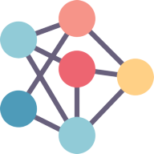

<!--
*** Thanks for checking out the Best-README-Template. If you have a suggestion
*** that would make this better, please fork the repo and create a pull request
*** or simply open an issue with the tag "enhancement".
*** Thanks again! Now go create something AMAZING! :D
-->

<!-- PROJECT SHIELDS -->
<!--
*** I'm using markdown "reference style" links for readability.
*** Reference links are enclosed in brackets [ ] instead of parentheses ( ).
*** See the bottom of this document for the declaration of the reference variables
*** for contributors-url, forks-url, etc. This is an optional, concise syntax you may use.
*** https://www.markdownguide.org/basic-syntax/#reference-style-links
-->
![Contributors][contributors-shield]
![Technologies Used][t-s]

<!-- PROJECT LOGO -->
 

  

  <h3 align="center">Algoforces</h3>

  

    <a href="https://github.com/whohet/Algoforces/"><strong>Explore the docs »</strong></a>
     
     
    <a href="https://algoforces.netlify.app/">View Demo</a>
    ·
    <a href="https://github.com/whohet/Algoforces/issues">Report Bug</a>
    ·
    <a href="https://github.com/whohet/Algoforces/issues">Request Feature</a>
  

<!-- TABLE OF CONTENTS -->

  
Table of Contents

  <ol>
    <li>
      <a href="#about-the-project">About The Project</a>
      <ul>
        <li><a href="#built-with">Built With</a></li>
      </ul>
    </li>
    <li>
      <a href="#getting-started">Getting Started</a>
      <ul>
        <li><a href="#prerequisites">Prerequisites</a></li>
      </ul>
    </li>
    <li><a href="#objectives">Objectives</a></li>
    <li><a href="#contributing">Contributing</a></li>
    <li><a href="#acknowledgements">Acknowledgements</a></li>
  </ol>

<!-- ABOUT THE PROJECT -->
## About The Project

Algoforces is an online judge platform where one can make an account and submit solutions to different predefined problems, similiar to that of Hackerrank, CSES, Codeforces etc.
The user interface is built with ReactJS, and the backend is built with NodeJS/ExpressJS, along with MongoDB as database.

### Built With

* [NodeJS](https://nodejs.org/en/)
* [ExpressJS](https://expressjs.com/)
* [PassportJS](https://www.passportjs.org/)
* [jDoodle](https://www.jdoodle.com/compiler-api/)
* [ReactJS](https://reactjs.org/)
* [MongoDB](https://www.mongodb.com/)
* [CKEditor](https://ckeditor.com/)

<!-- GETTING STARTED -->
## Getting Started

You can run the judge on your local system by forking the repo, downloading the source code, install the npm packages, getting your api keys and setting up as described in the '.env.example' and making a '.env' file.
However, you can visit 'https://algoforces.netlify.app/' to check out the already hosted application.

### Prerequisites

* JS development environment

<!-- USAGE EXAMPLES -->
## Objectives
Following are the objectives which the online judge fulfills.
1. Users can create account, which must be validated via a verification mail sent through
email.
2. Admin can set assign some users with problem setter role, which enables them to create
problem statements and relevant checker codes.
3. User can submit codes to the problems.
4. The code submitted must be run in a time and memory constrained environment, and
the system must return relevant verdict.

<!-- CONTRIBUTING -->
## Contributing

Contributions are what make the open source community such an amazing place to be learn, inspire, and create. Any contributions you make are **greatly appreciated**.

1. Fork the Project
2. Create your Feature Branch (`git checkout -b feature/AmazingFeature`)
3. Commit your Changes (`git commit -m 'Add some AmazingFeature'`)
4. Push to the Branch (`git push origin feature/AmazingFeature`)
5. Open a Pull Request

For more info, refer to [CONTRIBUTING](CONTRIBUTING.md)

<!-- CONTACT -->
## Contact

Het Patel - [@whohet](https://github.com/whohet) - whohet@gmail.com

Harshil Tagadiya - [@harshil-270](https://github.com/harshil-270) - harshiltagadiya@gmail.com

Project Link: [https://github.com/whohet/Algoforces](https://github.com/whohet/Algoforces)

<!-- ACKNOWLEDGEMENTS -->
## Acknowledgements
* [Ashish Lal](https://github.com/Silver-Snitch) (The OG) - For Providing Such Great Ideas

[contributors-shield]: https://img.shields.io/github/contributors/whohet/Algoforces
[contributors-url]: https://github.com/othneildrew/Best-README-Template/graphs/contributors
[t-s]: https://img.shields.io/badge/NodeJS-ReactJS-blue
[product-screenshot1]: images/ss1.png
[product-screenshot2]: images/ss2.png
[product-screenshot3]: images/ss3.png
[product-screenshot4]: images/ss4.png
[product-screenshot5]: images/ss5.png

